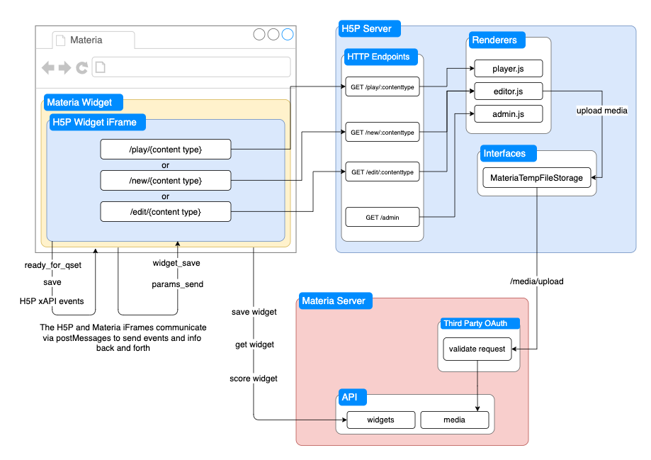

# H5P in Materia

This is a node server built to serve [H5P](h5p.org) widgets specifically for integration with [Materia](https://github.com/ucfopen/Materia). It is based on LumiEducation’s open source [H5P NodeJS Library](https://github.com/Lumieducation/H5P-Nodejs-library) implementation.

Although the server is set up to handle any number of h5p widgets, we currently support the following:

- [Interactive Video](https://h5p.org/interactive-video)
- [Multiple Choice](https://h5p.org/multichoice)
- [Quiz (Question Set)](https://h5p.org/question-set)
- [Advanced Fill in the Blanks](https://h5p.org/advanced-fill-the-blanks)
- [Mark the Words](https://h5p.org/mark-the-words)
- [Drag the Words](https://h5p.org/drag-the-words)

## Installation

Note: This project is under active development. If you're making code changes, we advise running it manually with the yarn commands below. Running it with docker will require destroying the h5p containers and images each time you want code changes to take effect.

### Docker

```
docker build --tag h5p-server:1.0 .
docker run --env ENVIRONMENT=mwdk --publish 3000:3000 --name h5p h5p-server:1.0
```

The server is currently configured to run at localhost:3000 in the browser. The publish flag exposes it to your local machine’s port 3000.

### Manual (No Docker)

Install the modules required:
`yarn install && ./setup.sh`
Start the server with
`yarn start:{mwdk/dev/prod}`
The server will be running at localhost:3000. If not in prod, view the h5p hub client at localhost:3000/admin.

### Configure .env

If you are running this server in the Materia stack, it will pull the .env file from there. However if you are running it alone with the steps above, you will have to create a `.env.local` file at the root directory, and add the following contents:

```
OAUTH_KEY="materia-third-party-oauth-key"
OAUTH_SECRET="third-party-oauth-secret"
MATERIA_URL="https://localhost:8008" # whatever your local static materia url is set to
```

Where the `key` and `secret` values have to match those on your local materia server. These will allow you to upload any media when creating an H5P widget.

## Development

### Selecting a Materia Environment Variable

This server utilizes postMessages to facilitate communication between H5P and Materia. It is configured to use the specified environment variable to determine which domain to send and receive postMessages.

| Env Var | Description                                                                                                                                                                                                                                                                                                                                                                                              |
| ------- | -------------------------------------------------------------------------------------------------------------------------------------------------------------------------------------------------------------------------------------------------------------------------------------------------------------------------------------------------------------------------------------------------------- |
| `mwdk`  | runs with the [Materia Widget Development Kit](https://ucfopen.github.io/Materia-Docs/develop/materia-widget-development-kit.html), a local server spun up quickly for developing individual Materia widgets                                                                                                                                                                                             |
| `dev`   | runs with your local instance of [Materia](https://github.com/ucfopen/Materia). An h5p widget must be built with the mwdk and exported to your local instance of Materia in order to use this.                                                                                                                                                                                                           |
| `prod`  | Used in production, points to your local instance of Materia, unless otherwise specified by the environment variable MATERIA_WEBSERVER_NETWORK. This env variable is used when integrated to the Materia docker stack to point to the Materia webserver directly (see docker-compose.yml in the Materia repo). Additionally, prod sets the env variable NODE_ENV=production which optimizes performance. |

### Porting New H5P Widgets

We would suggest using a simple H5P widget such as [Multiple Choice](https://github.com/ucfcdl/h5p-multichoice-materia-widget) as a reference point to port a new one. See the [Materia widget developer guide](https://ucfopen.github.io/Materia-Docs/develop/widget-developer-guide.html) for an in-depth understanding of Materia widgets.

1. Navigate to the /admin page and install the new library you want to port
2. Make a copy of the h5p multichoice repo as a template for your new widget repo.
   1. Rename all instances of `multichoice` in the repo to an appropriate name for your new widget
   2. In creator.js: the `paramsToQset()` function, remove code that modifies `qset.items` as this is content-specific to multichoice and will cause errors when you try to save an instance of your new widget.
   3. In player.js: update the `/play/1` url to the number created in step 3.b. below.
3. Update the h5p server to be able to handle loading this new widget:
   1. First you have to find the main library name/version for the widget you just installed. There are a couple ways to do so, one is to go into your h5p/libraries directory and look for the corresponding name. (For example if you just installed the Crossword widget, the library would look like `H5P.Crossword 0.4`).
   2. Next, in the h5p/content directory, we have an incrementing list of folders that correspond to h5p widget config files. It’s suggested to copy/paste the multichoice one as a template, increment the directory number, then
      1. rename the values as appropriate (`title`, `mainLibrary`, etc) .
      2. replace the `preloadedDependency` for `H5P.Multichoice` with the values for your main library. (For example for Crossword, replace `machineName` with `H5P.Crossword`, `majorVersion: 0`, `minorVersion: 4`).
   3. In `renderers/editor.js`: find the switch case that sets the selected library in `rendererInit()`. Add a case for your new library. For example in the case of crossword, the new case would look like
      ```
      case “h5p-crossword”:
      	window.selectedLibrary = “H5P.Crossword 0.4”;
      	break;
      ```
4. At this point you should be able to run `yarn start` in your new repo and see your new widget running at `localhost:8118`.
5. The next step would be to implement scoring for the widget (see [Implementing Scoring](#implementing-scoring) below)
6. You’ll want to create a demo for your widget, which can be used by users that want to try out functionality in Materia. Simply copy a working qset that you’d like to use into `demo.json`
7. Finally, the last step would be to port a compiled version of the widget from your MWDK (which you have been working in) to your local Materia installation.
   1. At the top right corner of your MWDK page, click `Download Package`. This will bring up a prompt where you can either
      - Download a .wigt file and manually install it to your local Materia
      - Click Install to Docker Materia where the MWDK will attempt to upload the widget automatically. Wait a few seconds to see a success or failure message pop up.

If you’re porting a widget that uses libraries not currently installed by one of the other widgets, you may need to add them yourself. While Interactive Video covers a large amount of the libraries available, it’s still possible you are porting a widget that requires others.
In development, this can be done by navigating to localhost:3000/admin and clicking `Install` on the widget you are porting. (same as step 1)
However if you want this widget to be supported by default when installing H5P in the future, you will need to update the `setup.sh` script. Use the only list of available library download links we currently know of [here](https://h5p.org/comment/18115#comment-18115) to grab a download link and copy an existing `curl` command to add its required libraries to the ones that get installed by default.

### Implementing Scoring

H5P widgets in Materia implement scoring using the data captured from H5P events (see [Integration with Materia](#integration-with-materia) below). Because each H5P widget is created differently, a standard scoring mechanism cannot be guaranteed for every H5P content type.
In your H5P widget’s `player.js`, you can start by printing out the events received to the console to see at which interactions you receive scoring data. In some cases it might be after every interaction, or it could not be until the very end of play. Typically, the best way to monitor for scoring events is to filter for events with the `event.data.result` property present.
Once you find when and where to get your score data, you can choose to utilize

- Materia’s default scoring module, which is written in php and found in `src/_score`. An example of this can be found in H5P widget repositories such as Interactive Video or Quiz Question Set.
- Write your own custom score module in javascript. An example of custom scoring can be found in quite a few H5P widget repositories such as Drag the Words.

To use a custom score module with the widget, you will have to add it to the `install.yaml` file config. Under `score:`, add the name of your custom score screen html file like so:

```
score:
	is_scorable: Yes
  	score_module: H5PMultiChoice
  	score_screen: scoreScreen.html
```

### H5P Server Customization

The behavior of h5p can be customized in a few different ways, see Lumi docs on [Customization](https://docs.lumi.education/advanced-usage/customization) for more details. When writing your own customization, remember to append a reference/URL of your script to the options parameter of the H5PEditor object in `express.js`, as defined in the docs.
We have implemented a few scripts that customize behavior in the `custom/` directory:

| Script                      | Description                                                                                                                                                   | How it Works                                                                                                                                                                                                                                                            |
| --------------------------- | ------------------------------------------------------------------------------------------------------------------------------------------------------------- | ----------------------------------------------------------------------------------------------------------------------------------------------------------------------------------------------------------------------------------------------------------------------- |
| `Fullscreen.js`             | Forces the h5p editor to be fullscreen within the iframe of the Materia widget, and removes a button that is unnecessary for Materia users.                   | Overrides h5p/editor/scripts/h5peditor-fullscreen-bar.js to grab a reference to the fullscreen html button and call `.click()` on it while the page is loading.                                                                                                         |
| `interactiveVideoUpload.js` | Prevents users from uploading videos specifically for the H5P Interactive Video Widget, since Materia cannot currently support video uploads.                 | Overrides h5p/editor/scripts/h5peditor-av.js to specifically remove the video file upload html that is inserted in the `C.createAdd()` function                                                                                                                         |
| `Hooks.js`                  | This hook is used to prevent users from uploading videos to any other widgets besides Interactive Video, since Materia currently can’t support video uploads. | utilizing [this](https://docs.lumi.education/advanced-usage/customization#changing-the-semantics-of-individual-libraries) provided `alterLibrarySemanticsHook` to intercept libraries as they are being loaded for a widget, removing the `H5P.Video` library if found. |

Though not the cleanest solution, the most effective way we’ve found to customize behavior is copying the scripts that power the editor (mostly found in h5p/editor/scripts/) to a custom script, and overwriting the parts you need to.

### Image Uploading to Materia

By default, the H5P server saves uploaded media to a file on the server in the `h5p/temporary-storage` directory. This implementation is built to be able to be overridden with a custom interface, which is what we have done in order to pass all media uploaded directly to the Materia server. The following resources were referenced to create our custom interface

- some sparse documentation of an implementation written for S3 upload [here](https://docs.lumi.education/npm-packages/h5p-mongos3/s3-temporary-file-storage)
- The full file for that S3 implementation [here](https://github.com/Lumieducation/H5P-Nodejs-library/blob/master/packages/h5p-mongos3/src/S3TemporaryFileStorage.ts)
- the actual implementation of the class from the original server found [here](https://github.com/Lumieducation/H5P-Nodejs-library/blob/master/packages/h5p-server/src/implementation/fs/DirectoryTemporaryFileStorage.ts)

You can find this custom built interface in `interfaces/MateriaTempFileStorage.js`. The high-level overview of this media uploading flow is

1. Create the file in a temporary directory on the server
2. Create a readstream using the temporary file
3. Upload this readstream directly to the Materia server with a POST request, which requires some OAuth steps.
4. If the upload was successful, Materia will send back a 5 digit hash that represents the ID of the file on the Materia server. We rename the temporary file with this 5 digit hash so that it matches up, and can be inserted into the qset when the user saves the widget they’re editing.

There’s also a cron job that can be found in `express.js` that is used to clean out this temporary directory daily at 3:00am.

## Setup and Docker Install Overview

The setup script

- Downloads the [H5P Core](https://github.com/h5p/h5p-php-library/archive/1.24.0.zip) and [H5P Editor](https://github.com/h5p/h5p-editor-php-library/archive/1.24.0.zip) files and unzips them into their requisite directories: h5p/core and h5p/editor respectively.
- It then downloads the library files needed for the h5p widgets we currently offer and unzips them into h5p/libraries. This is done for two reasons:
  - The install is automated and they do not have to be manually installed from the h5p hub client.
  - In prod, we do not have a reason to expose the `/admin` page, so no auth needs to be built into the server.

The Dockerfile that builds the server is incredibly simple, it

1. Copies the package.json to the container and installs the necessary dependencies
2. Copies the application source code to the container
3. Optionally can remove h5p/ directories in the container to ensure a fresh install of the server for development purposes
4. Runs the setup script
5. Exposes the port to your local machine
6. Starts the server

### Integrating into the Materia Stack

When integrated into the Materia Stack, this server sits in its own directory called `h5p-server/`. It is spun up with the rest of the Materia stack in Materia’s docker-compose file. There, a few configs need to be specified in order for the integration to be successful:

- An `arg` is added to the build config to specify what [Materia environment variable](#selecting-a-materia-environment-variable) we want to use. Don’t forget to update this to `prod` once you are ready to deploy to production alongside Materia!
- The correct ports are exposed between your local machine and the container (3000 for both, by default)
- The `frontend` network is specified, so that this container is capable of communicating with Materia’s `webserver` container, which is on the same network.
- The environment variable `MATERIA_WEBSERVER_NETWORK` is set to the name of Materia’s server container (`webserver`) so that h5p can send the upload requests to the corresponding URL

## Architecture and Integration

### H5P Server

Lumi provides a short overview of the architecture for their template server [here](https://docs.lumi.education/usage/architecture). There they provide the following visual diagram:

This application implements our own `Express Adapter` and `Temporary File Storage`, as well as customizations on various pieces described above, such as the `editor client` and `LibraryManager`. The `player client` is not shown but works similarly to the editor, just more simply with fewer endpoints.

### Integration with Materia


The above figure demonstrates the relationship between the Materia server, iFrame, and the H5P Server. H5P only talks to Materia to upload images that users upload in the creator.
The iFrames send postMessages back and forth to communicate events with each other:
| H5P iFrame to Materia Parent iFrame | Materia iFrame to H5P child iFrame |
| ----------------------------------- | ---------------------------------- |
| `ready_for_qset`: when editing or playing an existing widget, H5P requests the qset from Materia | `params_send`: response to `ready_for_qset`. When editing or playing an existing widget, Materia provides H5P the qset to load. |
| `save`: response to `widget_save`. Sends the library and h5p widget parameters to Materia to store in the qset when saving a widget | `widget_save`: Tells H5P that the widget is ready to be created. H5P will respond with `save` postMessage along with params to be encoded in the qset. |
| H5P xAPI Events: when H5P dispatches its own events from the user interacting with a widget, we capture them and send them to the Materia iFrame in case they are useful for scoring, etc. See H5P xAPI Docs (https://h5p.org/documentation/x-api) for light documentation. |
